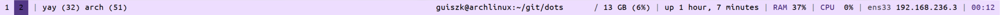
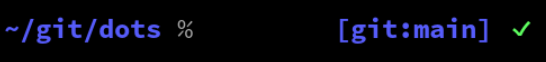

# dots
Personal configuration files.

## Files
Includes configs for `i3`, `polybar`, `zshrc`, `vimrc`, `crontab` and others.

Fonts go in `~/.fonts`, wallpapers in `~/.wallpaper`.

`backup.sh`: backs everything up to `~/dots`.

`setscreen.sh`: scales screen and sets up wallpaper.

`.dmenu_run`: run dmenu with pywal colors.

Polybar modules tested on Arch Linux.

## Polybar
bar

tinybar

## zsh 

